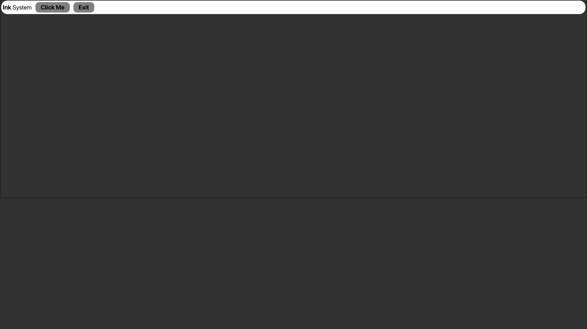
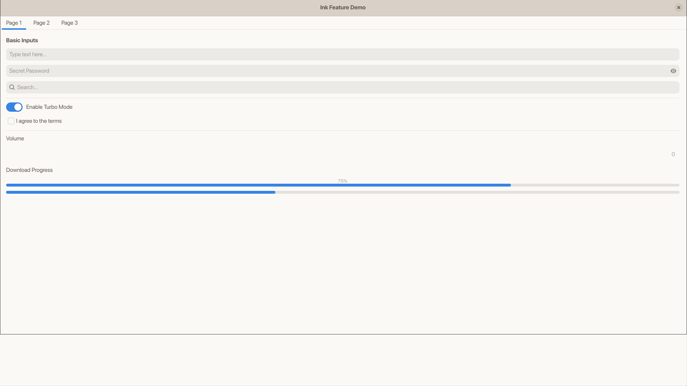
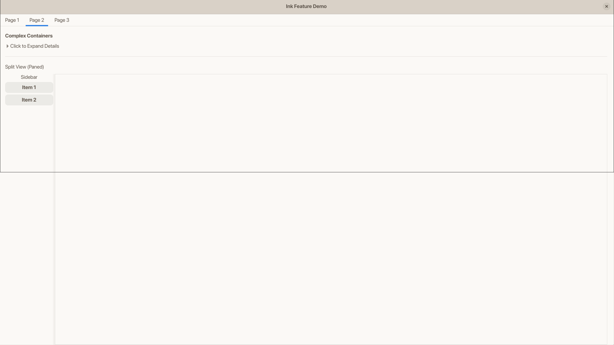
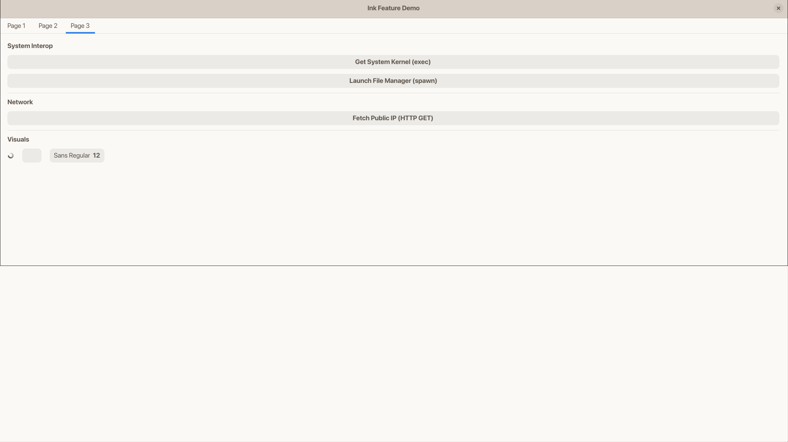

# Ink

GTK4 Layer Shell framework scriptable in Lua.

## Requirements

- gtk4
- gobject-introspection
- glib
- pango
- glib
- gdk-pixbuf
- gtk4-layer-shell
- libpulse

## Installation

Build from source using Cargo.

```bash
git clone https://github.com/hans-chrstn/Ink.git
cd ink
cargo build --release
cp target/release/ink /usr/local/bin/
```

## Usage

Run wiht a specific configuration file:

```bash
ink path/to/main.lua
```

Initialize a default configuration at `~/.config/ink/`

```bash
ink init
```

If no file is provided, Ink looks for ~/.config/ink/main.lua

More info using `ink -h`

## Configuration

Configuration is a Lua script returning a table:

```lua
return {
    type = "GtkApplicationWindow",
    window_mode = "layer_shell", -- "layer_shell" or "normal"
    layer = "top", -- "top", "bottom", "overlay", "background"
    anchors = { top = true, left = true, right = true, bottom = false },

    -- CSS Styling (Optional)
    css_path = "style.css", -- Relative to config file
    css = "button { background: red; }", -- Inline CSS

    properties = {
        title = "Ink Window",
        default_height = 40,
        css_classes = { "my-window" },
    },

    children = {
        {
            type = "GtkBox",
            properties = { orientation = "horizontal", spacing = 12 },
            children = {
                {
                    type = "GtkLabel",
                    properties = { label = "Hello World" }
                },
                {
                    type = "GtkButton",
                    properties = { label = "Click Me" },
                    signals = {
                        clicked = function()
                            print("Clicked")
                        end
                    }
                }
            }
        }
    }
}
```

## Examples

Bar (examples/bar)


Modularize Test (examples/modularize)





## Scripting API

Global function available:

- `exec(command: string) -> string` Run a shell command and wait for output.
- `spawn(command: string)` Run a shell command asynchronously.
- `fetch(url: string) -> string` Perform a blocking HTTP GET request and return a response body.

## Supported Widgets

- Containers: `GtkBox`, `GtkCenterBox`, `GtkPaned`, `GtkStack`, `GtkNotebook`, `GtkHeaderBar`, `GtkOverlay`, `GtkScrolledWindow`, `GtkExpander`, `GtkFrame`.
- Controls: `GtkButton`, `GtkToggleButton`, `GtkSwitch`, `GtkScale`, `GtkEntry`, `GtkPasswordEntry`, `GtkSearchEntry`, `GtkSpinButton`, `GtkCheckButton`, `GtkDropDown`.
- Display: `GtkLabel`, `GtkImage`, `GtkProgressBar`, `GtkSpinner`, `GtkLevelBar`, `GtkVideo`, `GtkCalendar`.

## License

MIT License
