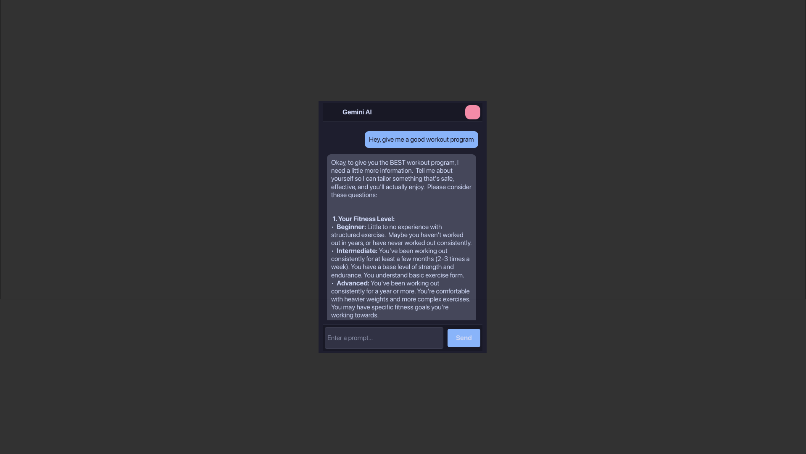
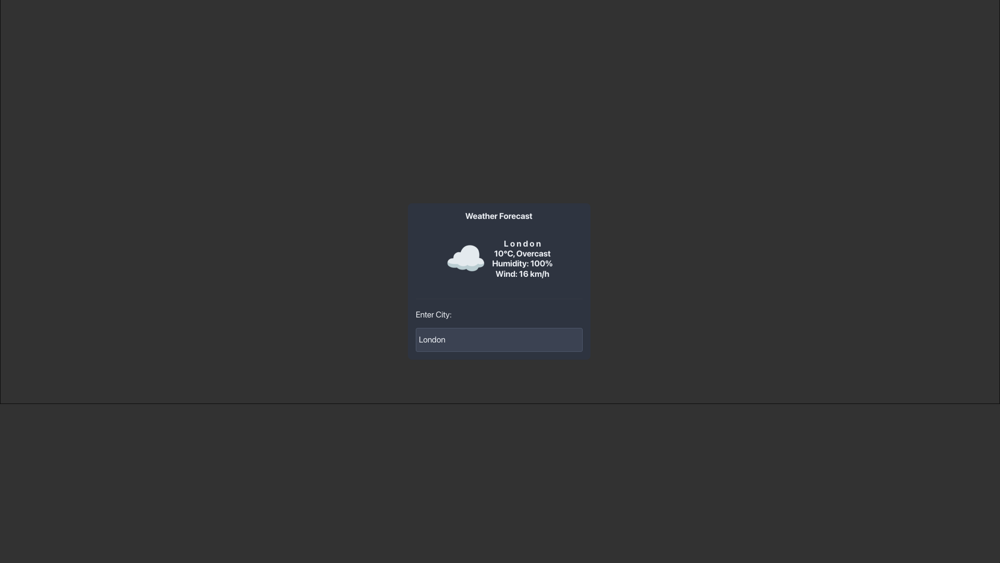

# Ink

Ink is a GTK4 Layer Shell framework that is scriptable in Lua. It allows you to create custom desktop widgets and applications using Lua scripts to define the UI structure, behavior, and styling.

## Features

- **GTK4 Layer Shell:** Create desktop widgets that integrate seamlessly with your desktop environment.
- **Lua Scripting:** Easily define your UI and application logic using the Lua scripting language.
- **Hot Reloading:** Automatically reload your UI when you make changes to your Lua scripts.
- **CSS Styling:** Customize the appearance of your widgets using CSS.
- **Extensible:** A growing set of built-in services for accessing system information, sending notifications, and more.

## Getting Started

### Installation

To build the project from source, you need to have Rust and Cargo installed, as well as the GTK4 development libraries.

```bash
cargo build --release
```

The compiled binary will be located at `target/release/ink`.

### Creating a Configuration File

To create a default configuration file, run the `init` command:

```bash
./target/release/ink init
```

This will create an `ink.lua` file in `~/.config/ink/`.

### Running the Application

To run the application, you need to provide a Lua configuration file:

```bash
./target/release/ink path/to/your/config.lua
```

If you don't provide a file, Ink will look for a default configuration at `~/.config/ink/init.lua`.

## Lua Scripting API

Your Lua script should return a table that defines the UI. This can be a single window definition or an array of window definitions.

### Window Definition

A window definition is a table with the following properties:

- `type`: The type of the root widget. This should be a valid GTK widget type (e.g., `GtkApplicationWindow`, `GtkWindow`).
- `window_mode`: (Optional) Can be set to `"layer_shell"` to create a layer shell window.
- `layer`: (Optional) The layer to display the window on. Can be `"background"`, `"bottom"`, `"top"`, or `"overlay"`.
- `anchors`: (Optional) A table that specifies how the window should be anchored to the edges of the screen.
- `margins`: (Optional) A table that specifies the margins of the window.
- `auto_exclusive_zone`: (Optional) A boolean that indicates whether the window should reserve space on the screen.
- `keyboard_mode`: (Optional) The keyboard interactivity mode.
- `css`: (Optional) A string containing CSS to be applied to the window.
- `css_path`: (Optional) The path to a CSS file to be loaded.
- `properties`: (Optional) A table of properties to be set on the root widget.
- `children`: (Optional) An array of child widget definitions.
- `signals`: (Optional) A table of signal handlers for the root widget.
- `keymaps`: (Optional) A table of keymaps to be set on the root widget.
- `actions`: (Optional) A table of actions to be added to the application.
- `menu`: (Optional) A table that defines the application's menu bar.
- `id`: (Optional) A unique identifier for the window.
- `realize`: (Optional) A function to be called when the window is realized.

### Widget Definition

A widget definition is a table with the following properties:

- `type`: The type of the widget (e.g., `GtkBox`, `GtkLabel`, `GtkButton`).
- `id`: (Optional) A unique identifier for the widget.
- `properties`: (Optional) A table of properties to be set on the widget.
- `children`: (Optional) An array of child widget definitions.
- `signals`: (Optional) A table of signal handlers for the widget.

### Globals

The following global functions and tables are available in the Lua environment:

#### `app` table

- `app.reload()`: Reloads the UI.
- `app.get_widget_by_id(id)`: Returns the widget with the specified `id`.
- `app.windows`: A table of all the windows created by the application, indexed by their titles.
- `app.on_ready`: A function that is called after the UI is built.
- `app.markdown_to_pango(markdown)`: Converts a Markdown string to a Pango markup string.
- `app.tray`: A table for managing the system tray. See the `Tray API` section for more details.

#### `Clipboard` table

- `Clipboard.set_text(text)`: Sets the clipboard text.
- `Clipboard.read_text(callback)`: Asynchronously reads the clipboard text and calls the `callback` function with the result.

#### Utility Functions

- `build_ui(config)`: Builds a UI from a Lua table.
- `notify(summary, body)`: Displays a desktop notification.
- `exit(code)`: Exits the application.
- `set_interval(ms, callback)`: Calls the `callback` function every `ms` milliseconds.
- `set_timeout(ms, callback)`: Calls the `callback` function after `ms` milliseconds.
- `exec(cmd)`: Executes a shell command and returns the output.
- `exec_async(cmd, callback)`: Executes a shell command asynchronously and calls the `callback` function with the result.
- `fetch(method, uri, headers, body)`: Performs an HTTP request.
- `fetch_async(method, uri, headers, body, callback)`: Performs an HTTP request asynchronously and calls the `callback` function with the result.
- `spawn(cmd)`: Spawns a new process.
- `graphemes(s)`: Splits a string into a table of its grapheme clusters.

### Services

Ink provides a number of services that can be accessed from your Lua scripts.

#### `apps` service

- `app.apps.get_desktop_actions(desktop_file_id)`: Returns a list of desktop actions for the specified desktop file.
- `app.apps.launch_desktop_action(desktop_file_id, action_name)`: Launches a desktop action.
- `app.apps.get_app_info(desktop_file_id)`: Returns information about the specified application.
- `app.apps.get_all_apps()`: Returns a list of all installed applications.

#### `audio` service

- `app.audio.get_sinks()`: Returns a list of audio sinks.
- `app.audio.get_sources()`: Returns a list of audio sources.
- `app.audio.set_sink_volume(sink_id, volume)`: Sets the volume of the specified sink.
- `app.audio.set_source_volume(source_id, volume)`: Sets the volume of the specified source.
- `app.audio.set_sink_mute(sink_id, mute)`: Mutes or unmutes the specified sink.
- `app.audio.set_source_mute(source_id, mute)`: Mutes or unmutes the specified source.
- `app.audio.get_default_sink()`: Returns the default audio sink.
- `app.audio.get_default_source()`: Returns the default audio source.

#### `dbus` service

- `app.dbus.call(bus, dest, path, interface, member, body)`: Calls a D-Bus method.

#### `fs` service

- `app.fs.read_file(path)`: Reads the contents of a file.
- `app.fs.write_file(path, content)`: Writes content to a file.
- `app.fs.watch_file(path, callback)`: Watches a file for changes and calls the `callback` function when the file is modified.

#### `json` service

- `app.json.parse(json)`: Parses a JSON string and returns a Lua table.
- `app.json.stringify(table)`: Converts a Lua table to a JSON string.

#### `system` service

- `app.system.get_env(name)`: Returns the value of an environment variable.
- `app.system.get_hostname()`: Returns the system hostname.
- `app.system.get_user()`: Returns the current user.
- `app.system.get_uptime()`: Returns the system uptime.

#### `tray` service

- `app.tray.set_icon(icon_path)`: Sets the system tray icon.
- `app.tray.set_menu(menu_table)`: Sets the system tray menu.

## Examples

### Gemini Widget



### Weather Widget



There are several more in the `examples/` directory

